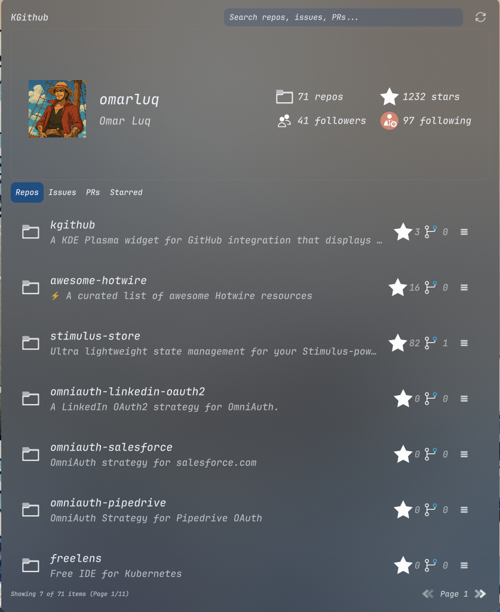
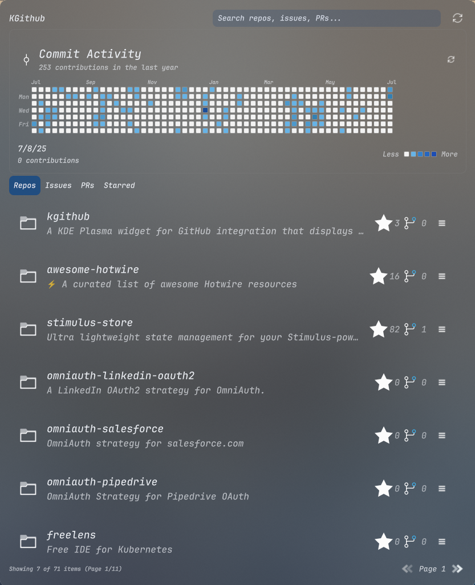
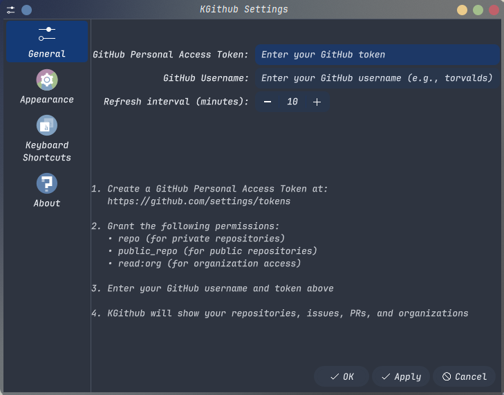
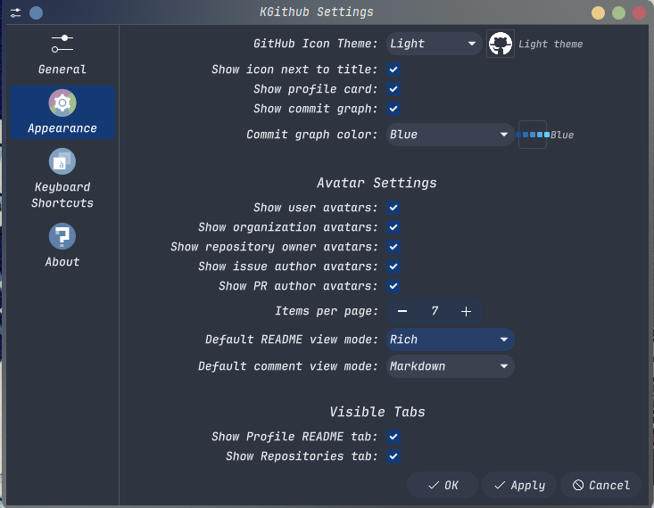
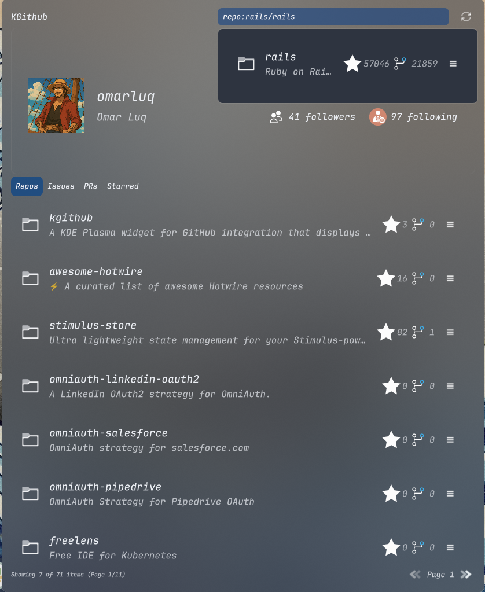

# KGitHub Plasmoid

Bring GitHub to your Plasma desktop.





## Features

- **User Profile Display** - View your GitHub profile with avatar and statistics
- **Repository Browser** - Browse repositories with pagination and detailed information
- **Issues Tracking** - Monitor open issues across all repositories
- **Pull Requests** - Track open pull requests
- **Organizations** - View organizations you belong to
- **Starred Repositories** - Browse starred repositories
- **Search Functionality** - Search repositories, issues, and pull requests
- **Configurable Interface** - Show/hide tabs and customize appearance
- **Auto-Refresh** - Configurable automatic refresh intervals

## Installation

### Prerequisites

- KDE Plasma 6.0+
- Qt 6.0+
- GitHub Personal Access Token

### Install from Source

```bash
# Clone the repository
git clone https://github.com/omarluq/kgithub.git
cd kgithub

# Install the plasmoid
make install
```

### Add to Desktop/Panel

1. Right-click on your desktop or panel
2. Select "Add Widgets..."
3. Search for "KGitHub"
4. Drag the widget to your desired location

## Configuration

### GitHub Token Setup

1. Go to [GitHub Personal Access Tokens](https://github.com/settings/tokens)
2. Click "Generate new token (classic)"
3. Select scopes: `repo`, `public_repo`, `read:org`
4. Copy the generated token



### Widget Configuration

1. Right-click the KGitHub widget
2. Select "Configure KGitHub..."
3. Enter your GitHub Personal Access Token and username
4. Configure refresh interval and visible tabs
5. Customize appearance settings



## Search



The search functionality supports both global and targeted searches:

### Global Search
Type any query to search across repositories, issues, and pull requests simultaneously.

### Targeted Search
Use prefixes for specific content types:
- `repo:` - Search repositories only
- `issue:` - Search issues only
- `pr:` - Search pull requests only

Examples:
- `repo:react` - Find repositories containing "react"
- `issue:bug fix` - Find issues about bug fixes
- `pr:feature` - Find pull requests about features


## Development

### Setup

```bash
git clone https://github.com/omarluq/kgithub.git
cd kgithub
make setup
```

### Code Quality

```bash
make lint           # Run qmllint on all QML files
make format         # Format QML files with qmlformat
make clean          # Remove trailing whitespace and extra spaces
make pre-commit     # Run all pre-commit checks
```

### Development & Testing

```bash
make test           # Test plasmoid with plasmoidviewer
make run            # Run plasmoid with plasmoidviewer (alias for test)
make setup          # Set up development environment with hooks
```

### Installation Management

```bash
make install        # Install plasmoid to KDE Plasma 6
make update         # Update existing plasmoid installation
make uninstall      # Remove plasmoid from KDE Plasma 6
make restart-plasma # Restart Plasma Shell (useful after install/update)
```

### Packaging

```bash
make package VERSION=1.0.0-alpha  # Create plasmoid package with version
```

### Other Commands

```bash
make help           # Show all available commands with descriptions
```

## Privacy & Security

- All data is cached locally in KDE configuration
- GitHub tokens are stored securely in KDE's configuration system
- Direct GitHub API communication only
- Rate limit aware to respect GitHub's API limits

## Troubleshooting

**Widget shows "Please configure GitHub token"**
- Enter a valid GitHub Personal Access Token in configuration
- Verify token has required scopes: `repo`, `public_repo`, `read:org`
- Check GitHub username is correct

**Empty or outdated data**
- Use the refresh button to update data manually
- Check internet connection
- Verify GitHub token hasn't expired

**Performance issues**
- Increase refresh interval in settings
- Widget uses intelligent caching to minimize API calls

## Contributing

1. Fork the repository
2. Create a feature branch
3. Make your changes
4. Run tests and linting (`make lint` and `make format`)
5. Submit a Pull Request

## License

MIT License - see [LICENSE](LICENSE) file for details.

## Support

- [Report Issues](https://github.com/omarluq/kgithub/issues)
- [Discussions](https://github.com/omarluq/kgithub/discussions)
- Email: omar.luqman@hey.com
